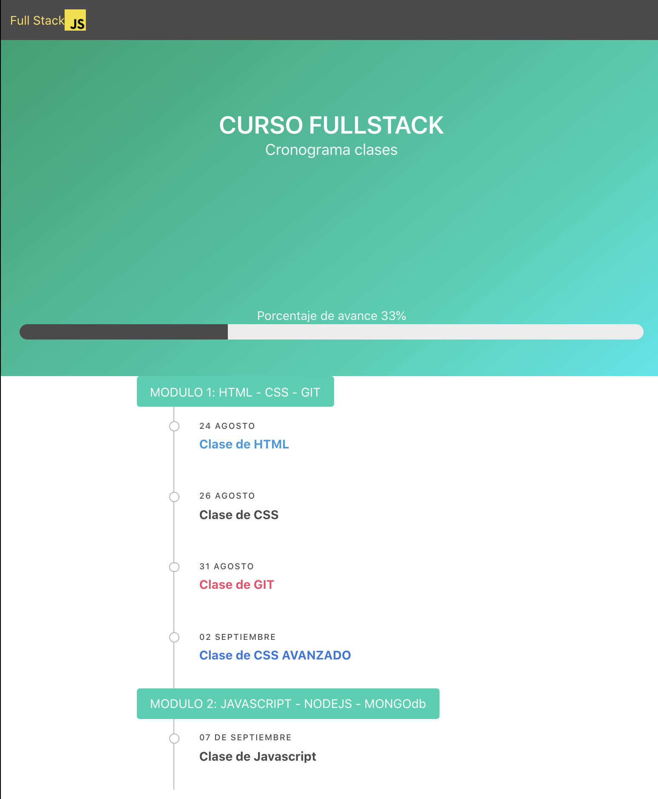

## Layout de ejemplo usando BULMA

## Instalación

En la carpeta assets/bulma ejecutar

`Sass bulma.sass bulma.css`

## create a new repository on the command line
echo "# frenon-layout-bulma" >> README.md
git init
git add README.md
git commit -m "first commit"
git branch -M master
git remote add origin https://github.com/mortegac/frenon-layout-bulma.git
git push -u origin master
                
## push an existing repository from the command line
git remote add origin https://github.com/mortegac/frenon-layout-bulma.git
git branch -M master
git push -u origin master